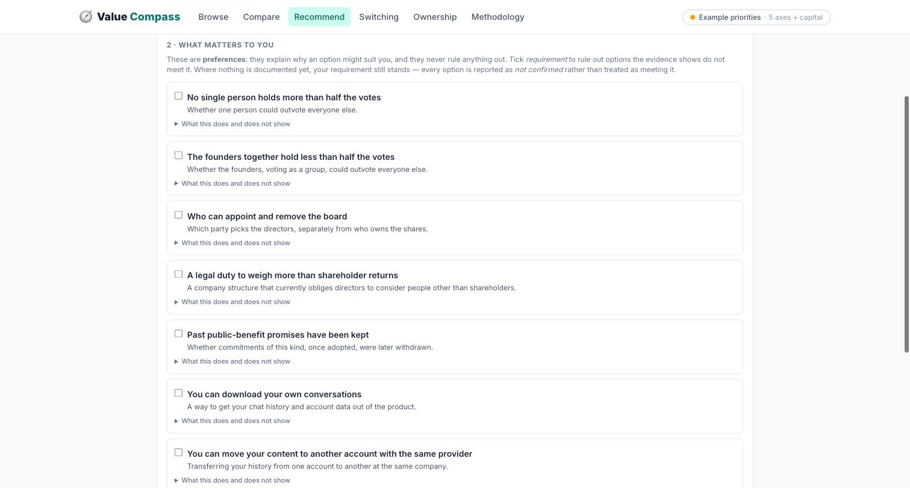
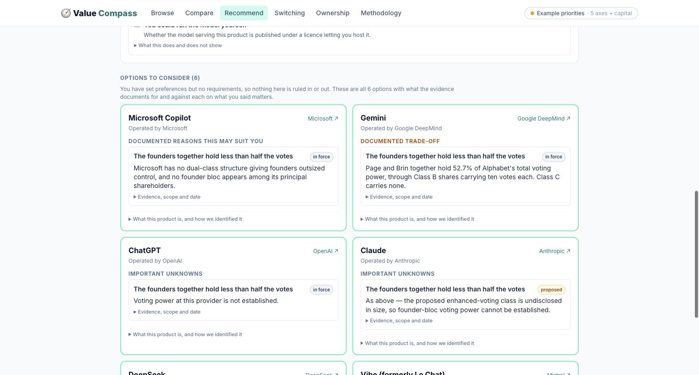
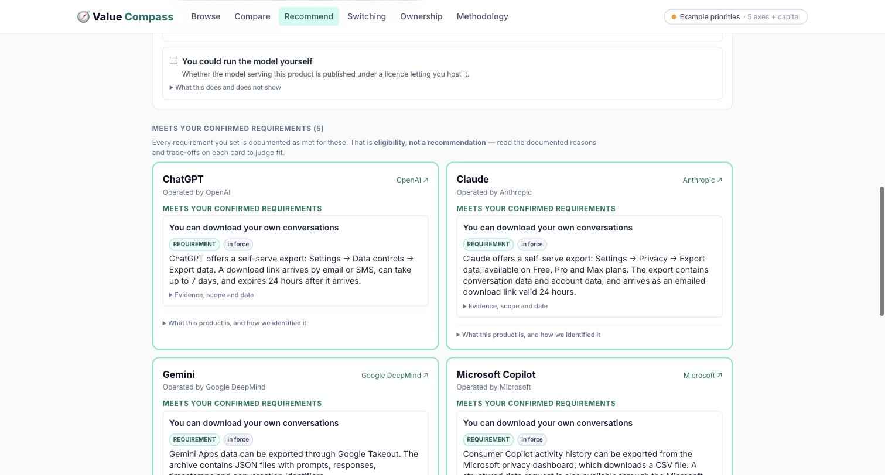
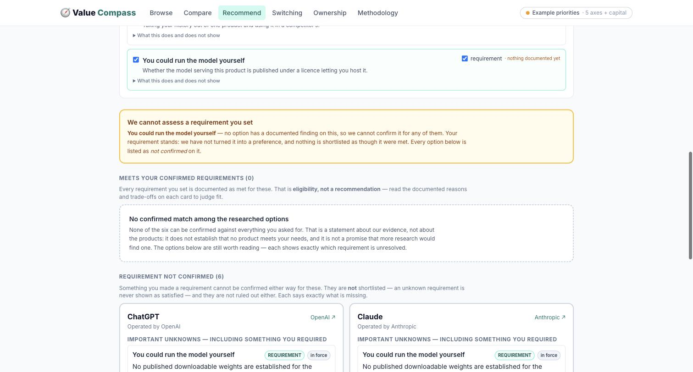
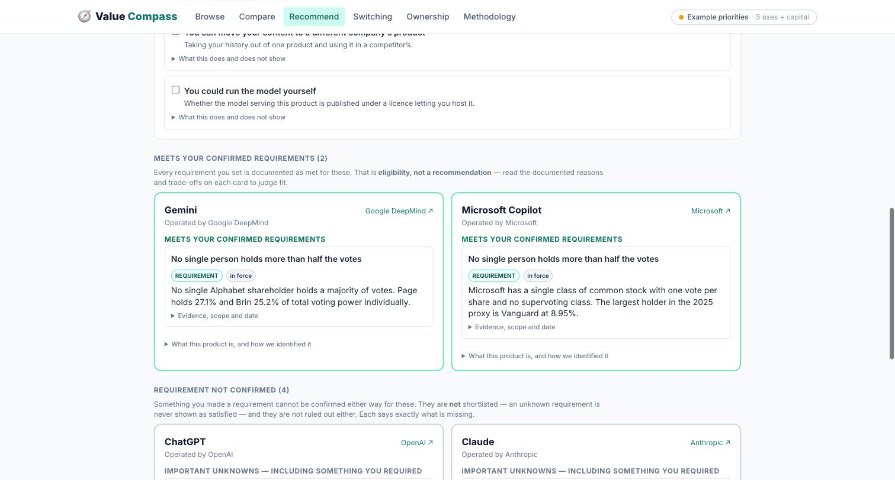
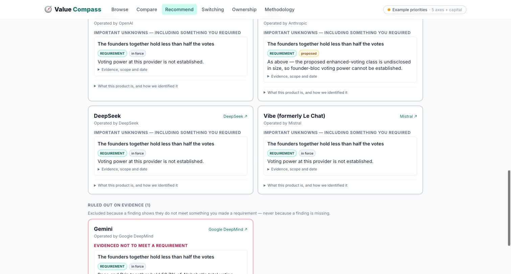

# Recommendation preview

The preview is at **`/recommend`**: one category, six researched alternatives, nine criteria.
It computes no score and produces no ranking.

Research 2026-09-17. Records in
[`src/data/recommendation-pilot.json`](../src/data/recommendation-pilot.json). Every finding
is **automated and provisional** — a model read a source; no human re-read one.

```bash
npm install
npm run dev          # → http://localhost:5173/#/recommend
npm test             # 78 checks, 51 on the recommendation engine
```

Nothing is deployed. `main` and the live site are untouched; this is all on
`fix/evidence-eligibility`.

---

## Corrections in this pass

### 1. The migration exclusion was wrong

Anthropic states that exported data *"can't be imported into another personal Claude
account, and we don't support migrating data between personal accounts."* I used that to
exclude Claude from **cross-service migration**. It does not support that: it is about one
destination — another Claude account — and says nothing about taking an export to a
competitor.

- A new criterion, **"You can move your content to another account with the same
  provider"**, carries the finding at its true scope. Claude is evidenced to fail it.
- **"You can move your content to a different company's product"** is now **unconfirmed for
  all six**. Nothing is excluded on it, and the criterion records what evidence would have
  to address: the destination product, and what actually has to transfer.

Two regression checks lock this: account-transfer evidence must not decide cross-service
eligibility, and a cross-service requirement must exclude nobody.

### 2. Eligibility is no longer dressed as a recommendation

With **no requirements set**, the heading is **"Options to consider"** — never "confirmed
matches". With requirements, it reads **"Meets your confirmed requirements"**, followed by:

> Every requirement you set is documented as met for these. That is **eligibility, not a
> recommendation** — read the documented reasons and trade-offs on each card to judge fit.

Inside each card, three distinct sections: **Documented reasons this may suit you** (fit),
**Documented trade-off**, and **Important unknowns**. Met requirements sit in their own
block. An option whose preference fit is unknown stays listed and discoverable, with the
unknown shown as unknown rather than as a match.

### 3. A requirement is never downgraded because evidence is missing

Previously, requiring something nothing was documented on silently demoted it to a
preference — substituting a different intention for the user's. Now the requirement stands,
the checkbox stays available with a "nothing documented yet" note, and the result explains:

> **We cannot assess a requirement you set.** *You could run the model yourself* — no option
> has a documented finding on this, so we cannot confirm it for any of them. Your requirement
> stands: we have not turned it into a preference, and nothing is shortlisted as though it
> were met.

### 4. Case D's labelling was inconsistent

I called them preferences and then described an exclusion. Checking the actual settings: the
runs used **hard requirements** — a soft preference cannot exclude, and never did. The
examples below are labelled correctly.

### 5. Information hierarchy

Cards now lead with the reason to consider, the trade-off and the unknowns. Source, scope,
date, uncertainty and provenance sit behind **"Evidence, scope and date"**; retrieval notes
and the product/model/release breakdown behind **"What this product is, and how we
identified it"**.

Criterion labels are rewritten to stand alone — *"No single person holds more than half the
votes"*, *"You can download your own conversations"* — with the caveats moved behind **"What
this does and does not show"** instead of sitting in front of the label.

---

## The four examples

### Input



### A · A soft preference with mixed evidence
*"The founders together hold less than half the votes" — preference, not a requirement.*

**Result: Options to consider (6). Nothing ruled in or out.** Copilot shows *Documented
reasons this may suit you*; Gemini shows *Documented trade-off* with the 52.7% finding;
ChatGPT and Claude show *Important unknowns* — Claude's marked **proposed**, because the
enhanced-voting class is undisclosed in size.



### B · A hard requirement with confirmed matches and unknown options
*"You can download your own conversations" — requirement.*

**Result: Meets your confirmed requirements (5).** DeepSeek sits in *Requirement not
confirmed*. Each card carries the mechanism in plain words, with the article number and date
behind the disclosure.



### C · A requirement nothing is documented on
*"You could run the model yourself" — requirement.*

**Result: 0 confirmed, 6 requirement-not-confirmed, 0 excluded**, with the limitation stated
at the top and the requirement preserved. This is correction 3 and the no-confirmed-match
state in one screen.



### D · Two voting questions, both as hard requirements

**"No single person holds more than half the votes": 2 confirmed** — Gemini and Copilot.
Page holds 27.1%, Brin 25.2%; neither is a majority.



**"The founders together hold less than half the votes": 1 confirmed** — Copilot only.
Gemini moves to *Ruled out on evidence* on the 52.7% combined figure.



Same filing, two questions, two answers. Both runs used hard requirements; as preferences
neither would exclude anything.

---

## What it can honestly recommend today

| Criterion | Coverage |
|---|---|
| Download your own conversations | **5 of 6 documented**, from official help centres |
| No single person holds more than half the votes | 2 documented |
| Founders together hold less than half the votes | 2 documented (1 meets, 1 fails) |
| A legal duty to weigh more than shareholder returns | 2 documented |
| Who can appoint and remove the board | 2 documented |
| Past public-benefit promises kept | 1 documented (a failure) |
| Move content to another account, same provider | 1 documented (a failure) |
| Move content to a different company's product | **0 — unconfirmed for all six** |
| Run the model yourself | **0 — unconfirmed for all six** |

Export is the criterion that can carry a real recommendation. The two portability criteria
below it cannot, and the preview says so rather than borrowing evidence from a neighbouring
question.

## Remaining research, by effect on a user's choice

1. **Cross-service migration for all six.** Now honestly at zero. Needs evidence naming a
   destination product and what has to transfer.
2. **Voting power for the other four.** Anthropic's ratio should appear in its prospectus;
   Mistral and DeepSeek are private and may be genuinely unavailable.
3. **DeepSeek's export.** The only gap in the strongest criterion.
4. **Account-to-account transfer for the other five.** One documented failure, five blanks.
5. **Model routing.** Only matters if someone requires self-hosting — but until each product
   maps to a model release, no licence finding can attach to a product.

## For the next review

These are the screens, not the rules. Worth watching someone use them:

- Does "Options to consider" read as weaker than "Meets your confirmed requirements"? It
  should — one is a list, the other is eligibility.
- Does *Requirement not confirmed* read as a soft no? It is meant to read as "we don't know,
  and here is what we'd need".
- Do the collapsed evidence sections get opened, or does the plain claim suffice?
- In case D, does the difference between the two voting questions land, or feel like
  pedantry? The distinction changes the answer; if it reads as pedantry, the labels need work.
