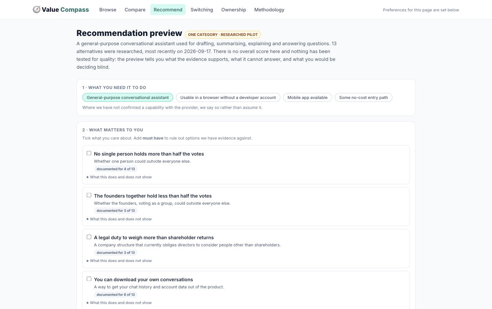
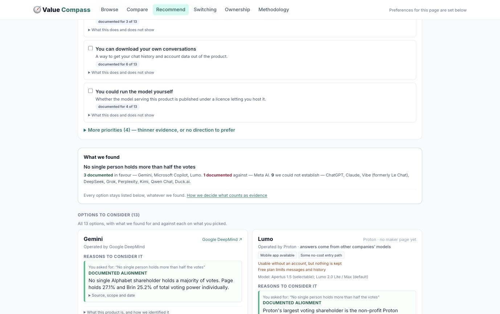
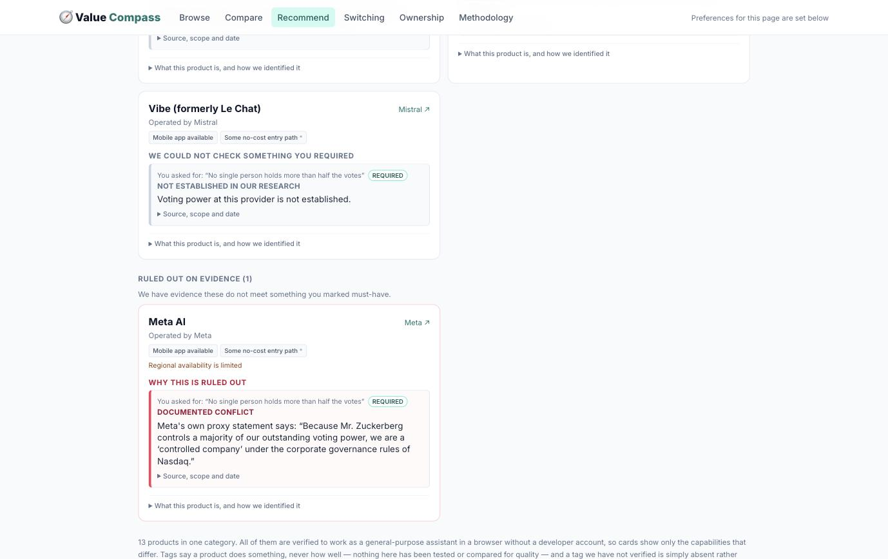
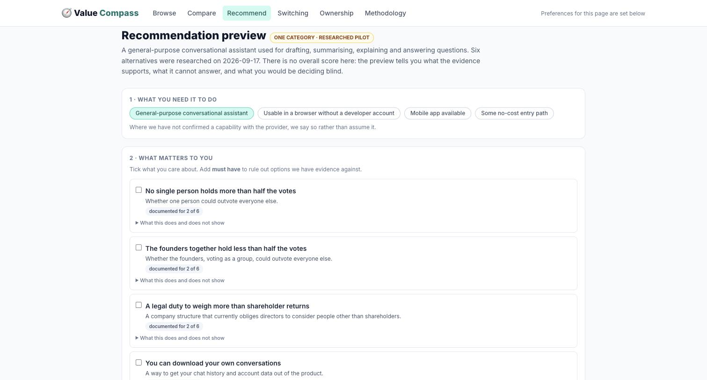
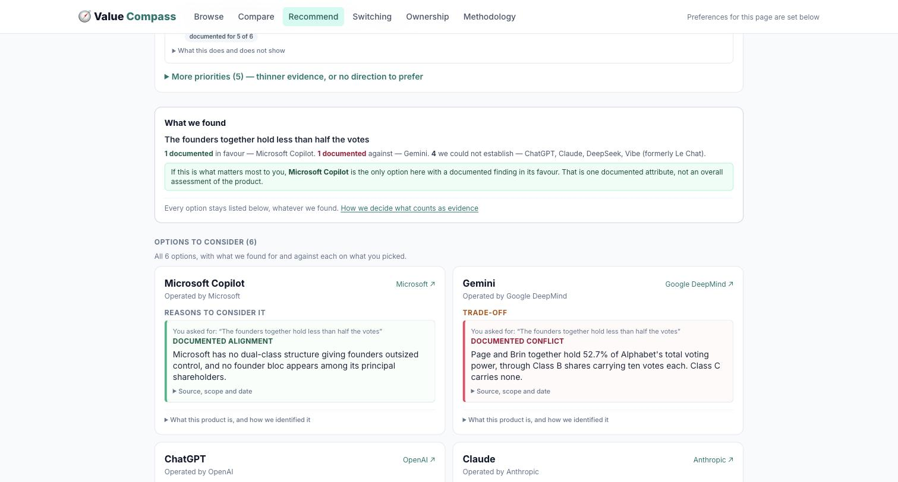
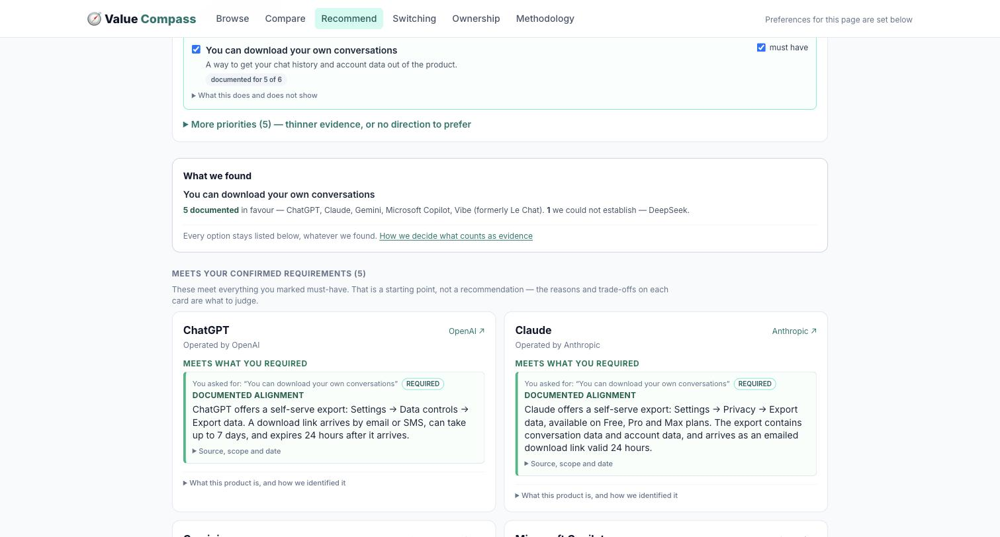
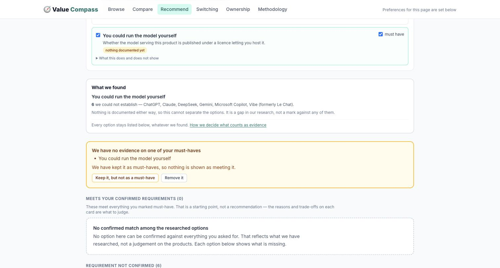
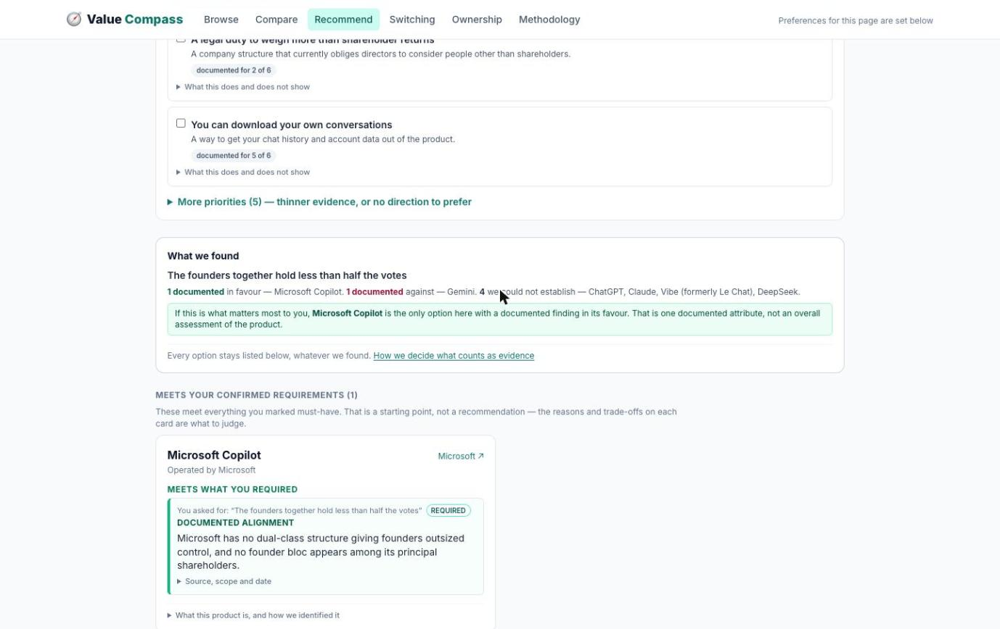

# Recommendation preview

The preview is at **`/recommend`**: one category, thirteen researched alternatives, nine criteria.
It computes no score and produces no ranking.

Research 2026-09-17. Records in
[`src/data/recommendation-pilot.json`](../src/data/recommendation-pilot.json). Every finding
is **automated and provisional** — a model read a source; no human re-read one.

```bash
npm install
npm run dev          # → http://localhost:5173/#/recommend
npm test             # 109 checks, 82 on the recommendation engine
```

Nothing is pushed or deployed. The work is committed to local `main`; `origin/main` and the
live site are untouched.

---

## Catalogue expansion (latest)

Seven products added, taking the pilot from six to thirteen. No new criteria, no scoring, no
redesign.

### What was already in the maker directory

The directory holds 18 makers. Four of them had an everyday assistant that the pilot simply
did not list — the familiar options a visitor would expect to compare:

| Maker | Already in directory | Product now in the pilot |
|---|---|---|
| Meta | yes, with an FMTI transparency score of 31/100 | **Meta AI** |
| xAI | yes, with an FMTI transparency score of 14/100 | **Grok** |
| Perplexity | yes | **Perplexity** |
| Moonshot AI | yes | **Kimi** |

These now attach to the existing maker entity by `maker_id` rather than creating a second
record, so the maker page and the pilot card cannot drift apart. A regression check asserts
it.

### What is newly available, and from operators with no maker page

Three operators are not in the directory at all. They are included anyway — missing
governance evidence is recorded as unknown, not treated as a reason to exclude a product:

| Product | Operator | In directory | What it adds |
|---|---|---|---|
| **Lumo** | Proton | no | The only option controlled by a non-profit foundation |
| **Duck.ai** | DuckDuckGo | no | Third-party models behind an anonymising operator; no account |
| **Qwen Chat** | Alibaba | no | A large listed operator whose filings we have not yet read |

Their cards say **“no maker page yet”** instead of linking to a page that does not exist.

### What each addition actually contributes

- **Meta AI** — the first *documented conflict* on individual control, from Meta's own DEF 14A
  filed 2026-04-16: *“Because Mr. Zuckerberg controls a majority of our outstanding voting
  power, we are a ‘controlled company’…”*. Before this, that criterion had two matches and no
  evidenced failure, so it could not rule anything out. It also has documented export, so it
  is not uniformly bad.
- **Lumo** — Proton's controlling shareholder is a non-profit foundation, legally bound under
  Swiss law to its purpose. It matches on individual control, board rights and public benefit.
  It is **not** flattered throughout: Proton documents no way to export your conversations.
- **Duck.ai** — an operator that publishes none of the models it serves. Its free tier
  includes an Apache-2.0 model. Ownership is opaque, so every governance criterion is unknown.
- **Kimi** — resolves a question this pilot previously left open. Moonshot's “Modified MIT”
  licence was read in full: the only deviation is that products above 100M monthly active
  users or $20M monthly revenue must display “Kimi K2”. Nothing restricts an individual.
- **Grok, Perplexity, Qwen Chat** — familiar products a visitor would expect to see. All three
  are thin on governance evidence and say so.

### The fairness check changed an existing record

Before crediting the new entries with the only self-hosting matches, we went back to the
original six. **DeepSeek qualifies too**: its changelog states *“The GA release of
DeepSeek-V4-Pro has been rolled out on the APP, Web, and API,”* and those weights are MIT on
Hugging Face. The previous pass recorded the app's routing as unverified — that was a gap in
our research, not a property of the product.

Mistral stays unconfirmed: Vibe runs “flagship Mistral models” with no named release.

### Scope: a hostable model is not a reproducible service

Every self-hosting match now carries the same sentence, asserted by a test:

> It does not establish that the assistant service can be reproduced or self-hosted — the
> search layer, retrieval, tools, apps and moderation around the model are not in the weights.

This matters most where the service *is* the point: running gpt-oss-120b yourself does not
reproduce Duck.ai's anonymising layer, and running Apertus does not reproduce Lumo's
zero-access encryption.

### Product distinctions on the cards

Each card now shows the operator, whether answers come from **other companies' models**,
the model release where established, verified capability tags, and access constraints
(“No account required”, “Regional availability is limited”, “Usable without an account, but
nothing is kept”).

Capability tags shared by all thirteen are the category's price of entry, so they are stated
once for the page and the cards show only what differs. Nothing implies comparative
performance: no product has been tested, and the page says so.

### A latent trap this surfaced

The functional records carried two spellings of the same status, `verified_official` and
`verified_official_documentation`. The existing filter accepted both; the new capability tags
accepted only one, which would have turned eleven researched capabilities into silent gaps.
The data is normalised to one spelling and a test now asserts the whole vocabulary, so a third
spelling fails loudly instead of quietly reading as unknown.

### Two scenarios, and whether the expansion helps

**“No one person should be able to override the board.”** Before: two matches, no evidenced
failures, nothing ruled out. After: **three match** (Gemini, Copilot, Lumo), **one is ruled
out** on Meta's own filing, nine remain unknown. The criterion now discriminates in both
directions, and Lumo is an option most people would not have considered. *The expansion
improves this decision.*

**“I want to be able to leave.”** Before: nothing documented for any option. After: four
documented matches (DeepSeek, Kimi, Lumo, Duck.ai) — but all four are matches on the *model*,
and cross-service migration is still unconfirmed for all thirteen. Someone who means “take my
conversations elsewhere” gets no more help than before, and the two privacy-first additions
are among the seven with no documented export at all. *The expansion does not improve this
decision.* It documents a different question more thoroughly.

### Expected products still missing, and why

| Product | Why not included |
|---|---|
| Pi (Inflection) | Consumer product effectively wound down after the 2024 Microsoft hire; existence as a live everyday assistant not established |
| HuggingChat | Could not establish it is still operating as a consumer assistant |
| Brave Leo | Browser-bound assistant; not established as usable as a standalone everyday assistant |
| Copilot (Apple/Siri) | Assistant embedded in an OS rather than a substitutable product in this category |
| Ernie (Baidu), Doubao (ByteDance) | Plausible category members; not researched in this pass |

Nothing was excluded for having thin governance evidence.

### Coverage after the expansion

| Criterion | Documented | Match / conflict |
|---|---|---|
| You can download your own conversations | 6 of 13 | 6 match |
| Who can appoint and remove the board *(informational)* | 4 of 13 | — |
| You could run the model yourself | 4 of 13 | 4 match |
| No single person holds more than half the votes | 4 of 13 | 3 match, **1 conflict** |
| A legal duty to weigh more than shareholder returns | 3 of 13 | 3 match |
| The founders together hold less than half the votes | 3 of 13 | 1 match, **2 conflicts** |
| Past public-benefit promises have been kept | 1 of 13 | 1 conflict |
| Move content to another account, same provider | 1 of 13 | 1 conflict |
| Move content to a different company's product | **0 of 13** | — |

### Screenshots







### Research gaps that still block useful guidance

1. **Cross-service migration, all thirteen.** Still zero. The portability question most people
   actually mean.
2. **Export for the seven undocumented**, including both privacy-first additions.
3. **Alibaba's filings.** A listed company with a published annual report and a distinctive
   partnership board structure, unread.
4. **SpaceX's acquisition of xAI.** Reported February 2026; SpaceX files no proxy, so Grok's
   ownership cannot be established to this pilot's standard. The directory still lists xAI as
   a standalone maker.
5. **Which model serves each product**, for Meta AI, Grok, Qwen Chat and Perplexity.

---

## Presentation pass

Six changes to how `/recommend` reads. No new research, no scoring, nothing deployed.
Screenshots `10`–`14` show the current state; `00`–`06` are the previous pass, kept for
comparison.

### 1. A preference is no longer dressed as a finding

Every evidence block now separates what you asked for from what we found:

> You asked for: "The founders together hold less than half the votes"
> **DOCUMENTED CONFLICT**
> Page and Brin together hold 52.7% of Alphabet's total voting power…

Previously the criterion label sat as the heading, so Gemini's card read *"the founders
together hold less than half the votes"* directly above a finding saying they hold 52.7%.
The finding heading is now one of three, and always names the evidence, never the wish:
**Documented alignment** · **Documented conflict** · **Not established in our research**.

### 2. A result summary, without a nomination

A **What we found** panel sits above the buckets and counts, per criterion, how many
options are documented in favour, documented against, and unestablished.

Where exactly one option holds the only finding in favour, it says so — stated as one
attribute, not a verdict:

> If this is what matters most to you, **Microsoft Copilot** is the only option here with a
> documented finding in its favour. That is one documented attribute, not an overall
> assessment of the product.

Where several align, or nothing is documented, it offers no direction at all. Tests lock
both.

### 3. Colour follows evidence, not cards

Card borders are neutral. Colour is confined to the evidence block, so a card is no longer
tinted green or red as though the product itself had been graded.

### 4. Inputs express preferences

- **Board-election rights is marked informational.** We have findings for 2 of 6, but the
  arrangements differ in kind, not degree — there is no direction to prefer. It is offered
  as information and contributes nothing to the summary.
- **Criteria are split** into four with usable coverage and five behind *More priorities —
  thinner evidence, or no direction to prefer*.
- **Each carries its coverage** before you pick it: `documented for 5 of 6`, `documented for
  2 of 6`, `nothing documented yet`.

### 5. Implementation commentary is out of the main flow

The repeated explanations about eligibility, missing-data handling and preserving intention
are replaced with short user-facing text. Where a rule has a consequence, it now comes with
actions rather than a paragraph — the unassessable-requirement panel offers **Keep it, but
not as a must-have** and **Remove it**. Methodology stays linked from `/about`.

### 6. The header no longer implies unrelated defaults

The chip read *"Example priorities · 5 axes + capital"* on `/recommend`. Checked: that page
holds its own state and never reads the site-wide priorities, so the chip was describing
settings that do not drive it. On `/recommend` it now reads *"Preferences for this page are
set below"*; elsewhere it is unchanged.

### A bug this pass surfaced

The summary counted only surviving options. Make the founder-bloc criterion a requirement
and Gemini is excluded — and its 52.7% finding disappeared from the counts, which read
*1 in favour, 4 unestablished* for six products. The evidence that did the excluding was
deleted from the report of what we found.

Counts now span all six. Direction is still only offered for an option you can still choose,
so an excluded option is counted but never pointed at.

---

## The examples

### Input



Four criteria with usable coverage; five behind the disclosure. Coverage is visible before
you choose.

### A soft preference with mixed evidence

*"The founders together hold less than half the votes" — preference only.*



Nothing is ruled in or out. The summary reports 1 / 1 / 4 and names Copilot as the sole
documented alignment; Gemini shows the conflict as a trade-off.

### A hard requirement with confirmed matches

*"You can download your own conversations" — must-have.*



Five confirmed, DeepSeek unconfirmed. Five align, so the summary offers no direction.

### A must-have nothing is documented on

*"You could run the model yourself" — must-have.*



The requirement stands rather than quietly becoming a preference. The panel names it, keeps
it, and offers the two ways out.

### The same criterion as a hard requirement



Copilot confirmed, Gemini ruled out on the 52.7% finding, four unconfirmed — and the
summary still counts all six.

---

## Corrections in the previous pass

### 1. The migration exclusion was wrong

Anthropic states that exported data *"can't be imported into another personal Claude
account, and we don't support migrating data between personal accounts."* I used that to
exclude Claude from **cross-service migration**. It does not support that: it is about one
destination — another Claude account — and says nothing about taking an export to a
competitor.

- A new criterion, **"You can move your content to another account with the same
  provider"**, carries the finding at its true scope. Claude is evidenced to fail it.
- **"You can move your content to a different company's product"** is now **unconfirmed for
  all six**. Nothing is excluded on it, and the criterion records what evidence would have
  to address: the destination product, and what actually has to transfer.

Two regression checks lock this: account-transfer evidence must not decide cross-service
eligibility, and a cross-service requirement must exclude nobody.

### 2. Eligibility is no longer dressed as a recommendation

With **no requirements set**, the heading is **"Options to consider"** — never "confirmed
matches". With requirements, it reads **"Meets your confirmed requirements"**, followed by:

> Every requirement you set is documented as met for these. That is **eligibility, not a
> recommendation** — read the documented reasons and trade-offs on each card to judge fit.

Inside each card, three distinct sections: **Documented reasons this may suit you** (fit),
**Documented trade-off**, and **Important unknowns**. Met requirements sit in their own
block. An option whose preference fit is unknown stays listed and discoverable, with the
unknown shown as unknown rather than as a match.

### 3. A requirement is never downgraded because evidence is missing

Previously, requiring something nothing was documented on silently demoted it to a
preference — substituting a different intention for the user's. Now the requirement stands,
the checkbox stays available with a "nothing documented yet" note, and the result explains:

> **We cannot assess a requirement you set.** *You could run the model yourself* — no option
> has a documented finding on this, so we cannot confirm it for any of them. Your requirement
> stands: we have not turned it into a preference, and nothing is shortlisted as though it
> were met.

### 4. Case D's labelling was inconsistent

I called them preferences and then described an exclusion. Checking the actual settings: the
runs used **hard requirements** — a soft preference cannot exclude, and never did. The
examples below are labelled correctly.

### 5. Information hierarchy

Cards now lead with the reason to consider, the trade-off and the unknowns. Source, scope,
date, uncertainty and provenance sit behind **"Evidence, scope and date"**; retrieval notes
and the product/model/release breakdown behind **"What this product is, and how we
identified it"**.

Criterion labels are rewritten to stand alone — *"No single person holds more than half the
votes"*, *"You can download your own conversations"* — with the caveats moved behind **"What
this does and does not show"** instead of sitting in front of the label.

---

## The four examples, as captured in the previous pass

These screenshots predate the presentation pass above; the findings are unchanged.

### Input


### A · A soft preference with mixed evidence
*"The founders together hold less than half the votes" — preference, not a requirement.*

**Result: Options to consider (6). Nothing ruled in or out.** Copilot shows *Documented
reasons this may suit you*; Gemini shows *Documented trade-off* with the 52.7% finding;
ChatGPT and Claude show *Important unknowns* — Claude's marked **proposed**, because the
enhanced-voting class is undisclosed in size.


### B · A hard requirement with confirmed matches and unknown options
*"You can download your own conversations" — requirement.*

**Result: Meets your confirmed requirements (5).** DeepSeek sits in *Requirement not
confirmed*. Each card carries the mechanism in plain words, with the article number and date
behind the disclosure.


### C · A requirement nothing is documented on
*"You could run the model yourself" — requirement.*

**Result: 0 confirmed, 6 requirement-not-confirmed, 0 excluded**, with the limitation stated
at the top and the requirement preserved. This is correction 3 and the no-confirmed-match
state in one screen.


### D · Two voting questions, both as hard requirements

**"No single person holds more than half the votes": 2 confirmed** — Gemini and Copilot.
Page holds 27.1%, Brin 25.2%; neither is a majority.


**"The founders together hold less than half the votes": 1 confirmed** — Copilot only.
Gemini moves to *Ruled out on evidence* on the 52.7% combined figure.


Same filing, two questions, two answers. Both runs used hard requirements; as preferences
neither would exclude anything.

---

## What it can honestly recommend today

| Criterion | Coverage |
|---|---|
| Download your own conversations | **5 of 6 documented**, from official help centres |
| No single person holds more than half the votes | 2 documented |
| Founders together hold less than half the votes | 2 documented (1 meets, 1 fails) |
| A legal duty to weigh more than shareholder returns | 2 documented |
| Who can appoint and remove the board | 2 documented |
| Past public-benefit promises kept | 1 documented (a failure) |
| Move content to another account, same provider | 1 documented (a failure) |
| Move content to a different company's product | **0 — unconfirmed for all six** |
| Run the model yourself | **0 — unconfirmed for all six** |

Export is the criterion that can carry a real recommendation. The two portability criteria
below it cannot, and the preview says so rather than borrowing evidence from a neighbouring
question.

## Remaining research, by effect on a user's choice

1. **Cross-service migration for all six.** Now honestly at zero. Needs evidence naming a
   destination product and what has to transfer.
2. **Voting power for the other four.** Anthropic's ratio should appear in its prospectus;
   Mistral and DeepSeek are private and may be genuinely unavailable.
3. **DeepSeek's export.** The only gap in the strongest criterion.
4. **Account-to-account transfer for the other five.** One documented failure, five blanks.
5. **Model routing.** Only matters if someone requires self-hosting — but until each product
   maps to a model release, no licence finding can attach to a product.

## For the comprehension test

These are the screens, not the rules. Worth watching someone use them:

- Does the **You asked for / finding** split land, or do people still read the criterion
  label as the answer?
- Does **What we found** get read before the cards, and does the sole-alignment line read as
  a recommendation? It is meant to read as one attribute.
- Does *Requirement not confirmed* read as a soft no? It is meant to read as "we don't know,
  and here is what we'd need".
- Do people open **More priorities**, or does the split hide things they wanted?
- Does `nothing documented yet` stop someone choosing a criterion, and is that the right
  outcome?
- When a must-have cannot be assessed, do people reach for **Keep it, but not as a must-have**
  or **Remove it** — and does either feel like it did what they meant?
- Do the collapsed evidence sections get opened, or does the plain claim suffice?
- Does the difference between the two voting questions land, or feel like pedantry? The
  distinction changes the answer; if it reads as pedantry, the labels need work.
