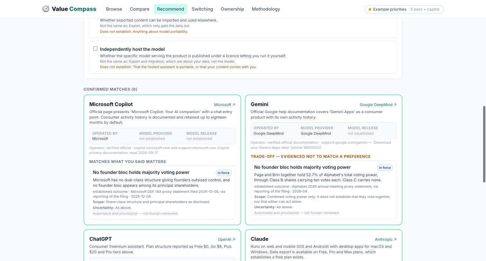
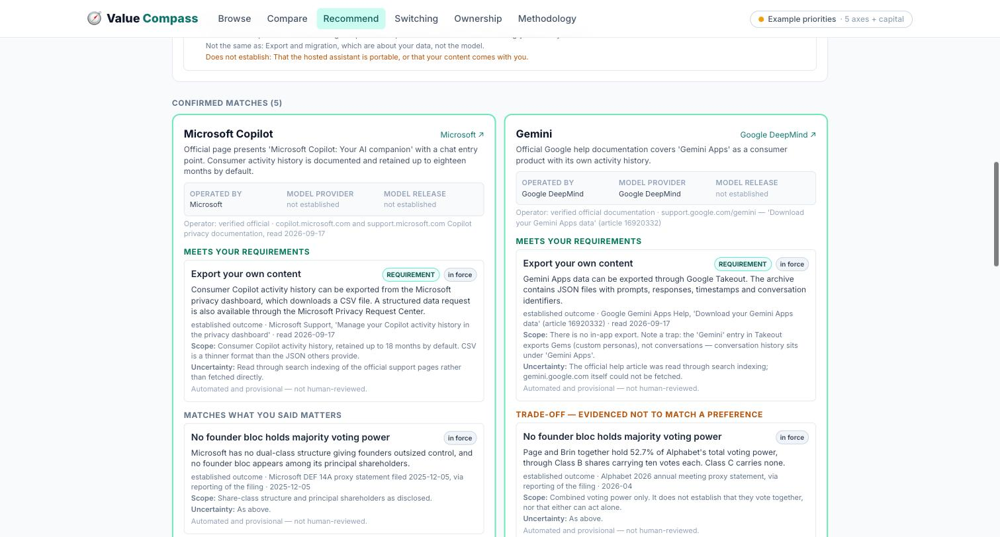
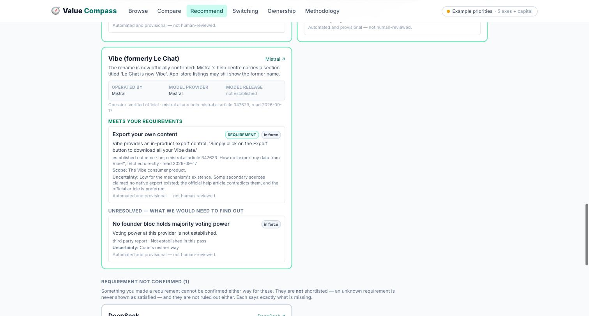
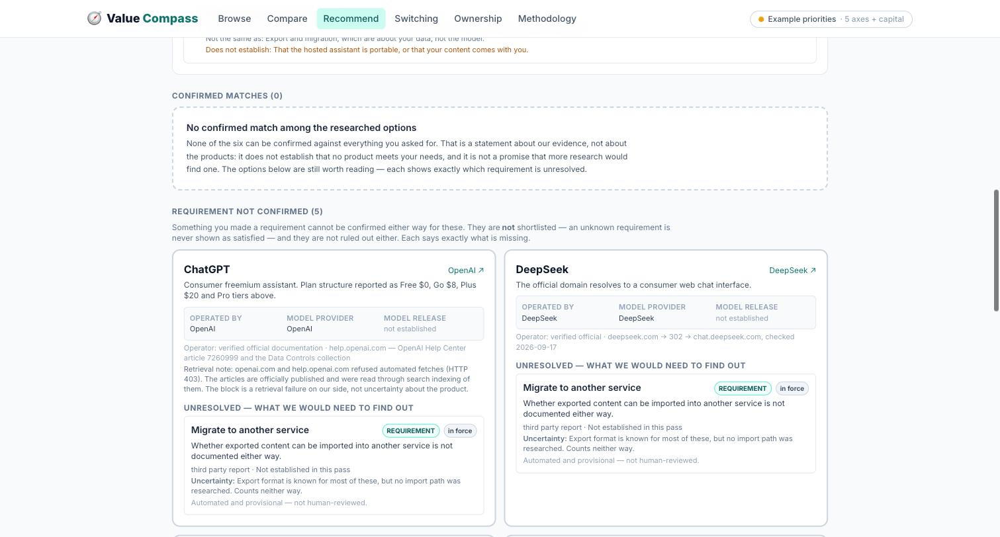
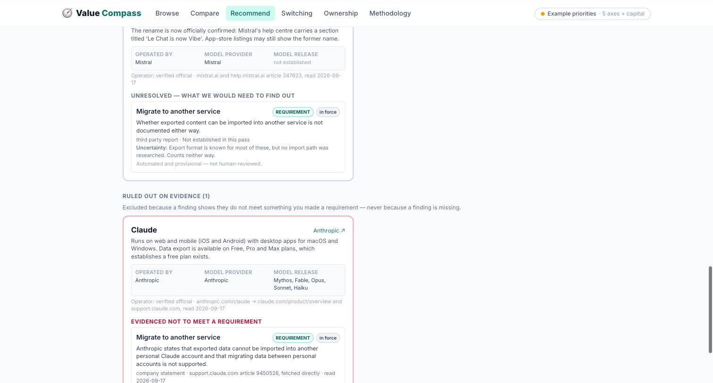
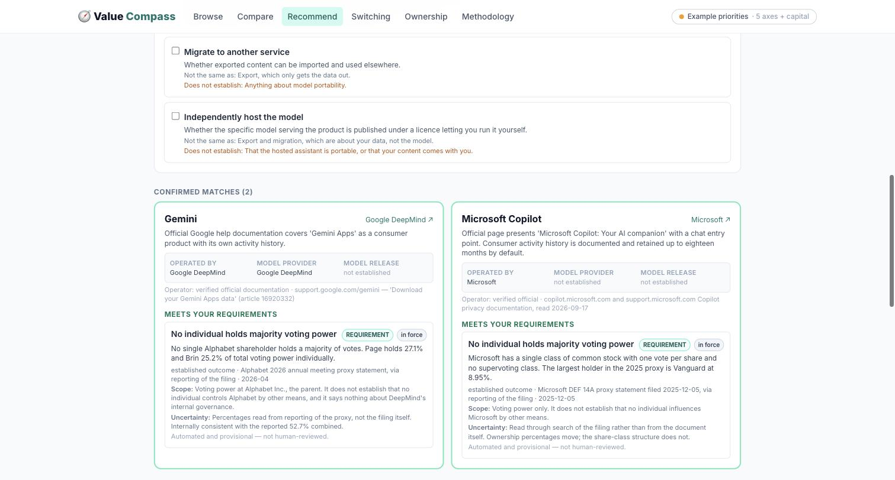
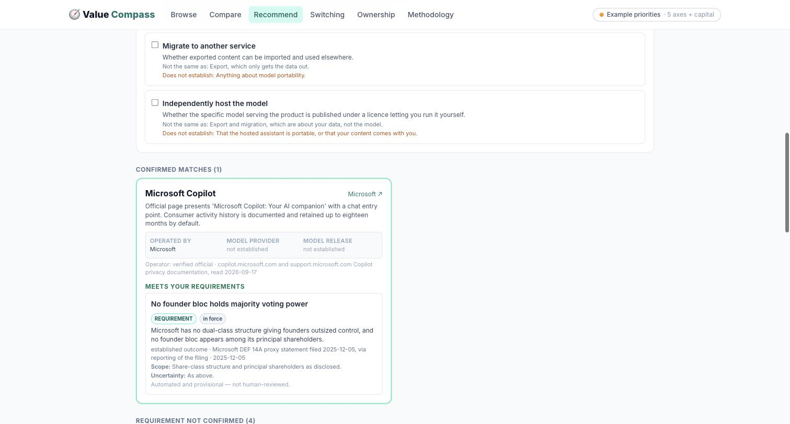
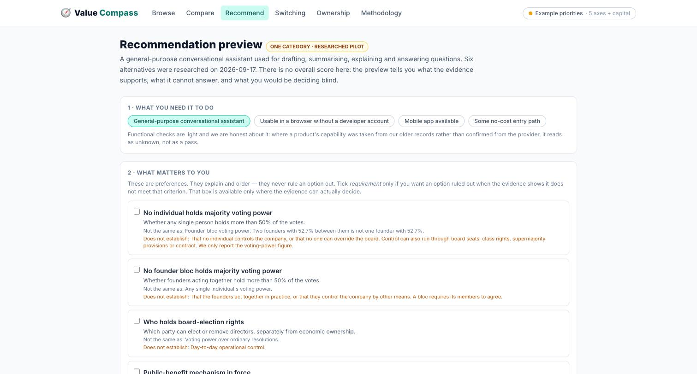

# Recommendation preview — review pass

The preview is at **`/recommend`**. This records what changed in this pass, the four
exercised cases with their actual results, and what is left.

Research 2026-09-17. Records in
[`src/data/recommendation-pilot.json`](../src/data/recommendation-pilot.json). Every finding
is **automated and provisional** — a model read a source; no human re-read one.

---

## Run it locally

```bash
npm install
npm run dev          # → http://localhost:5173/#/recommend
npm test             # 67 checks, 40 on the recommendation engine
```

No deployment. `main` and the live site are untouched; this is all on
`fix/evidence-eligibility`.

---

## What changed

### 1. An unknown requirement can no longer look satisfied

There was a real bug here, and it was the reverse of the one asked about: an unknown **soft
preference** was pushing options out of the shortlist. Options now sort into three states:

| State | Meaning |
|---|---|
| **Confirmed match** | Every stated requirement is evidenced met |
| **Requirement not confirmed** | A requirement cannot be settled either way — visible, not shortlisted, not excluded |
| **Ruled out on evidence** | A finding shows it *fails* a stated requirement |

An unknown soft preference now does neither: it is reported under "unresolved", and the
option stays exactly where it was. Screenshot 04 shows Vibe sitting in **Confirmed matches**
with an unresolved preference displayed below its met requirement.

### 2. Control language is scoped to the voting-power figure

"No individual with majority voting control" became **"No individual holds majority voting
power"**, and every control criterion now carries an explicit *Does not establish* line:

> **Does not establish:** That no individual controls the company, or that no one can
> override the board. Control can also run through board seats, class rights, supermajority
> provisions or contract. We only report the voting-power figure.

The per-finding scope says the same at the level of the claim — Alphabet's reads *"It does
not establish that no individual controls Alphabet by other means, and it says nothing about
DeepMind's internal governance."*

### 3. Product provider, model provider and model release are separate

Every card now shows all three. Copilot reads **Operated by Microsoft / Model provider not
established / Model release not established** — an unknown model no longer contaminates who
operates the product, and Microsoft's share structure still answers the governance question.
That is visible in screenshots 07 and 08, where Copilot is a confirmed match on both voting
criteria despite its model routing being unknown.

### 4. Retrieval failures are recorded apart from factual uncertainty

`help.openai.com` returns 403 to automated fetching. That is now stated on the card as a
retrieval note and does not weaken ChatGPT's identity:

> Retrieval note: openai.com and help.openai.com refused automated fetches (HTTP 403). The
> articles are officially published and were read through search indexing of them. The block
> is a retrieval failure on our side, not uncertainty about the product.

Identity was resolved through official documentation, not by logging into anything.
**Four of six verified from official sources directly**, two through official help-centre
documentation read via search indexing. Two things surfaced:

- **Mistral's rename is now official.** The help centre carries a section titled *"Le Chat
  is now Vibe."* The product shows as **Vibe (formerly Le Chat)**.
- **DeepSeek's consumer product is confirmed** — `deepseek.com` 302s to `chat.deepseek.com`.

### 5. Export research done; portability stays three questions

Prioritised as instructed, and it transformed coverage — **content export went from 0 to 5 of
6 confirmed**, all from official documentation:

| Product | Export | Source |
|---|---|---|
| ChatGPT | Settings → Data controls → Export data; email link, up to 7 days | OpenAI Help Center art. 7260999 |
| Claude | Settings → Privacy → Export data; Free/Pro/Max | support.claude.com art. 9450526 *(fetched)* |
| Gemini | Google Takeout; JSON archive. **No in-app export** | Gemini Apps Help art. 16920332 |
| Copilot | Privacy dashboard → CSV | Microsoft Support |
| Vibe | *"Simply click on the Export button"* | help.mistral.ai art. 347623 *(fetched)* |
| DeepSeek | **Unconfirmed** — no official article found; secondary reports say email request | — |

Two findings worth having:

- **Gemini has a trap.** The "Gemini" entry in Takeout exports *Gems* (custom personas), not
  conversations — history sits under "Gemini Apps". Recorded in the scope line.
- **Claude is evidenced to fail migration.** Anthropic states exported data *"cannot be
  imported into another personal Claude account"*. Export and migration are genuinely
  different answers for the same product, which is why they are separate criteria.

Voting-control coverage went 1 → 2 per predicate (Microsoft added: single share class, one
vote per share, largest holder Vanguard 8.95%). Model routing/licensing was **not** researched
further — no exercised requirement needed it.

---

## The four exercised cases

### A · A soft preference with mixed evidence
*Preference: no founder bloc holds majority voting power. Not a requirement.*

**Result: 6 confirmed matches. Nothing excluded.** Copilot shows it under "Matches what you
said matters"; Gemini shows it under "Trade-off — evidenced not to match a preference" with
the 52.7% finding; four others show it unresolved. A preference explains and orders — it
never removes an option.



### B · A hard requirement with confirmed matches and unknown options
*Requirement: export your own content.*

**Result: 5 confirmed, 1 requirement-not-confirmed (DeepSeek), 0 excluded.** Each card
carries the mechanism, the article number, the date, the scope and the uncertainty.



Vibe's card below shows the fix from §1 — a met requirement *and* an unresolved preference,
still in Confirmed matches:



### C · A requirement with no confirmed match
*Requirement: migrate to another service.*

**Result: 0 confirmed, 5 requirement-not-confirmed, 1 ruled out.** The heading reads *"No
confirmed match among the researched options"*, and the page says explicitly that this does
not establish that no product meets the need and is not a promise that more research would
find one.



Claude is the only exclusion, and only because Anthropic states it — not because five are
unknown:



### D · The two voting-control preferences
*Same filing, two questions, two different answers.*

**As "no individual holds majority voting power": 2 confirmed — Gemini and Copilot.**
Page holds 27.1% and Brin 25.2%; neither is a majority.



**As "no founder bloc holds majority voting power": 1 confirmed — Copilot only.**
Gemini moves to ruled-out on the 52.7% combined figure.



This is the case that most justifies the preview existing: the user's own wording changes the
recommendation, and the interface makes them choose rather than choosing for them.

The input state, with the *Does not establish* lines a user reads before picking:



---

## What it can honestly recommend today

- **Content export** — five confirmed from official documentation, one unconfirmed. The
  strongest criterion, and the most practically useful.
- **Voting power** — two providers confirmed on each predicate, precisely scoped, with the
  broader claims explicitly disclaimed.
- **Public-benefit mechanisms in force** — Claude and ChatGPT, unranked.
- **Migration** — one evidenced exclusion, five unknown. A useful negative.

It **cannot** recommend on independent model hosting: zero decided findings, so the
requirement checkbox is disabled for it and the criterion degrades to a preference rather
than emptying the list.

---

## Remaining research, by effect on a user's choice

1. **Voting power for the other four.** Two of six covered. Anthropic's ratio will be in its
   prospectus; Mistral and DeepSeek are private and may be genuinely unavailable.
2. **DeepSeek's export.** The only gap in the strongest criterion. An official help page or a
   confirmed request route would close it.
3. **Import paths for the other five.** We know Claude refuses; nobody else is researched.
   Migration is currently one exclusion and five blanks.
4. **Model routing.** Only needed if someone selects model hosting, which is why it was
   deprioritised — but until each product maps to a model release, no licence finding can
   ever attach to a product.
5. **Mobile and free-tier confirmation for Gemini, Copilot and DeepSeek.** Currently unknown,
   so selecting those functional needs moves three products to requirement-not-confirmed.

## For the next review

The question is whether a visitor can understand and use this — not whether the rules pass.
Three things worth watching someone do:

- Do they notice the *Does not establish* lines before ticking a criterion, or after?
- Does "Requirement not confirmed" read as a soft no? It is meant to read as *"we don't
  know, and here is what we'd need"*.
- In case D, does the distinction between the two voting questions land, or does it feel like
  pedantry? If it reads as pedantry the labels need work — the distinction itself is sound and
  changes the answer.
